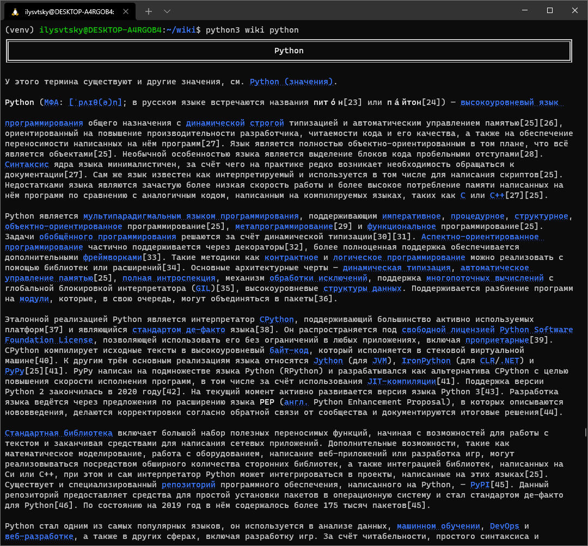

# Wiki cli searcher

Right now it is only able to search in Russian wikipedia. Techichally can search in every MediaWiki website (api to be added)

Works by requesting generated page contents, filtering them? converting them to Markdown and then displaying them.

## Usage:
```
python3 wiki python
```

## Result:
